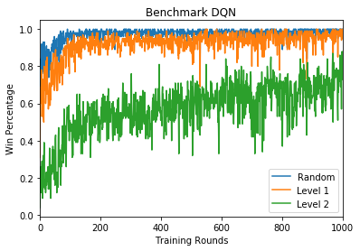

# Connect 4
A simple implementation of the Connect 4 game - from game theory solvers to deep learning based solvers

## Code

The file `connect4.py` implements the Connect 4 board. The file `connect4players.py` constains the implementation of the following players:
- Random player:
  - Plays a random move from the possible moves.
- Left player:
  - Plays on the left most possible collumn.
- Player Lvl 1:
  - Plays on winning move if one is available.
  - Otherwise plays randomly.
- Player Lvl 2:
  - Plays on winning move if one is available.
  - Otherwise, it selects a move to block the opponent from winning, if such move exits.
  - Otherwise plays randomly.
- One-step Player Lvl 1:
  - Uses an heuristic to score the valid moves and plays the highest scoring one.
- One-step Player Lvl 2:
  - Same as One-step Player Lvl 1 but with an improved heuristic.
- Minmax Player Lvl 1:
  - Looks 3 moves ahead with a minmax algorithm to decide its next move. Uses the same heuristic has One-step Player Lvl 1.
- Minmax Player Lvl 2:
  - Same as Minmax Player Lvl 1 but with the improved heuristic of One-step Player Lvl 2.
- Alpha-beta Player Lvl 1:
  - Same as Minmax Player Lvl 1 but with alpha-beta prunning.
- Alpha-beta Player Lvl 2:
  - Same as Minmax Player Lvl 2 but with alpha-beta prunning.

The Jupyter Notebook `Connect4.ipynb` contains an analysis of the quality of the players. In the table below, you can fin the winning percentage of player againsts Player Lvl 2 from a total of 100 games where each player goes first half the times.

| Left Player | Random Player | Player Lvl 1 | One-step Player Lvl 1 | One-step Player Lvl 2 |
|-------------|---------------|--------------|-----------------------|-----------------------|
| 0%          | 3%            | 17%          | 70%                   | 92%                   |

## DQN
The file `trainDQN.py` implements a Deep Q-Network (DQN) that learns how to play Connect 4 by self-play (inspired by [2]). Two DQN are created and play againsts themselves taking turns on who starts first. At the end of each game, the weights of each network are updated. There are several choices that can be made regarding the exploration strategty, loss function, optimizer, different neural network architectures among others. See the file for all the options.

Below the evolution of the DQN during training is displayed. Each training round corresponds to 1000 self-play games. The DQN is evaluted by playing 100 games against three distinct players: Random Player, Player Level 1, Player Level 2. Each player starts the game half the times. The DQN quickly learns how to beat the Random Player and similarly for Player Level 1. 

## To do list
- [X] Implement base players.
- [X] Implement minmax players.
- [X] Implement alpha-beta prunning for minmax algorithm.
- [ ] Implement move exploration for minmax algorithm.
- [X] Implement Deep Q-Network (DQN).
- [ ] Implement Actor Critic agent.
- [ ] Implement Asynchronous Actor Critic (A3C) agent.
- [ ] Implement Alpha GO like agent.

## References
1. Kaggle Micro Course: [Intro to Game AI and Reinforcement Learning](https://www.kaggle.com/learn/intro-to-game-ai-and-reinforcement-learning).
1. Learning to play Connect 4 with Deep Reinforcement Learning https://codebox.net/pages/connect4
